# AOT-GAN Experiments (AmOCo)

[](https://opensource.org/licenses/MIT)
[](https://pytorch.org/)

## Contents
1. [Overview](#1-overview)
2. [Setup Instructions](#2-setup-instructions)
3. [Repository Overview](#3-repository-overview)
4. [Reproduction](#4-reproduction)
5. [Experiments on Places2](#5-experiments-on-places2)
6. [Experiments on COCOA](#5-experiments-on-places2)

## 1. Overview

This repo contains the code for my experiments on [AOT-GAN](https://github.com/researchmm/AOT-GAN-for-Inpainting).


## 2. Setup Instructions

- Clone the repo:

```shell
git clone https://github.com/praeclarumjj3/AOT-GAN-Experiments.git
cd AOT-GAN-Experiments
```

### Download the PConv Masks

- Download the [PConv Masks](https://nv-adlr.github.io/publication/partialconv-inpainting):
``` 
wget https://www.dropbox.com/s/qp8cxqttta4zi70/irregular_mask.zip?dl=1  // training dataset
wget https://www.dropbox.com/s/qp8cxqttta4zi70/test_mask.zip?dl=1       // testing dataset
```

### Download the Places2 dataset
- Download the **Places2** dataset:
```
wget http://data.csail.mit.edu/places/places365/places365standard_easyformat.tar
```

### Download the COCOA dataset

- Download the **MS-COCO 2014** images and unzip:
```
wget http://images.cocodataset.org/zips/train2014.zip
wget http://images.cocodataset.org/zips/val2014.zip
```

- Download the annotations and untar:
``` 
gdown https://drive.google.com/uc?id=0B8e3LNo7STslZURoTzhhMFpCelE
tar -xf annotations.tar.gz
```

- The COCOA dataset has annotations for only `2500 training images` and `1300 validation images`. So, if you want to use only those images, run:

```shell
python prepare_cocoa_flist.py
```

- On the other hand, the original COCO2014 dataset has about `83k training images` and `40k validation images`. So, if you want to use all images, run:

```shell
python prepare_coco_flist.py
```
---

- Unzip the files according to the following structure

```
AOT-GAN-Experiments
├── dataset
│   ├── places2 (rename places365 folder)
│   ├── pconv (rename the folder inside irregular_mask / test_mask)
│   ├── COCOA
│   │   ├── annotations
│   │   ├── train2014
│   │   ├── val2014
│   │   ├── train.txt
│   │   ├── val.txt
```
---

- Install [Pytorch](https://pytorch.org/get-started/locally/) and other dependencies creating a conda environment:

```shell
conda env create -f environment.yml 
conda activate inpainting
```

## 3. Repository Overview

The repository is structured as follows:

- `src` - All the source code files.
    - `data` - Dataset related scripts.
    - `loss` - Scripts for loss functions.
    - `model` - Scripts containing the structure of the model.
    - `scripts` - Contains shell scripts for running code.
    - `utils` - Utility scripts.
    - `trainer`: Trainer Class for training the model.
- `visulaizations` - All kinds of diagrams and plots.

## 4. Reproduction

### Test Demo

Run the following scripts

```
sh test.sh
```

#### Official Pretrained Models

Download the [Places2](https://drive.google.com/drive/folders/1bSOH-2nB3feFRyDEmiX81CEiWkghss3i) model.

```
gdown https://drive.google.com/uc?id=1FgeLfUONic3IP690YhlpGpowXqi_NEAb
```

#### Testing with trained models

Replace the name of the model in [test.sh](test.sh) file.

### Training

- You can change the cofigurational parameters for training in the `src/utils/option.py` file.
- Run the following command to train the **AOT-GAN** model for `1e4 iterations`:

```shell
$ sh scripts/train.sh
```

If you encounter any errors, install the [pretty-errors](https://pypi.org/project/pretty-errors/) package to see the beautified errors.

```shell
$ python -m pip install pretty_errors

$ python -m pretty_errors
```

## 5. Experiments on Places2

- In the plots below:
    - **Rec Loss** =  *λ<sub>1</sub>* L<sub>rec</sub> + *λ<sub>2</sub>* L<sub>perceptual</sub> + *λ<sub>3</sub>* L<sub>style<sub>  ; λ<sub>1</sub> = 1, λ<sub>2</sub> = 0.1, λ<sub>3</sub> = 250
    - **Adv G Loss** = 0.01 * L<sub>gen_gan</sub>
    - **Adv D Loss** = L<sub>gen_disc</sub> 

### Results using the Testing PConv Mask Dataset without Style Loss

The model was trained for `10000 iterations` on a total of `18034 images` with  `batch size=8`. The checkpoint frequency was `2000 iterations`.

<p float="center">
  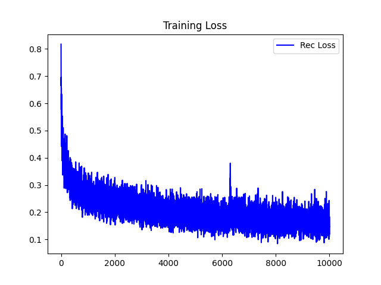
  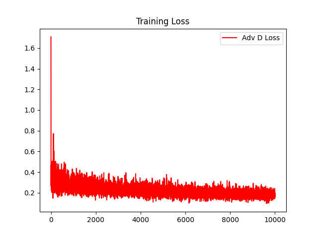
  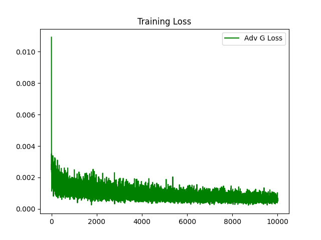
</p>

You can find more iteration-wise results in **[visualizations folder under no_style in pconv_test](visualizations/pconv_test/no_style)**.

#### Demo Results

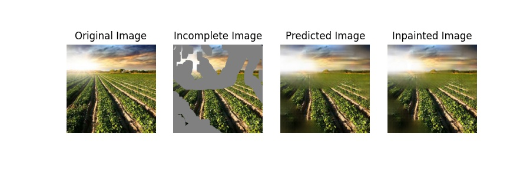

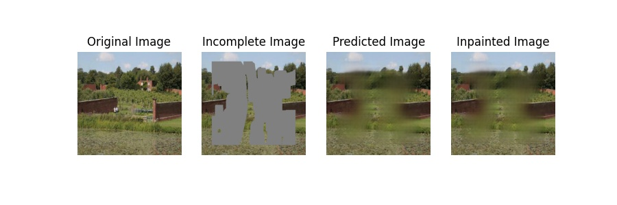

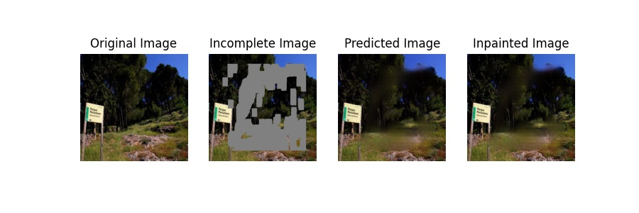


### Results using the Testing PConv Mask Dataset with Style Loss

The model was trained for `10000 iterations` on a total of `18034 images` with  `batch size=8`. The checkpoint frequency was `2000 iterations`.

<p float="center">
  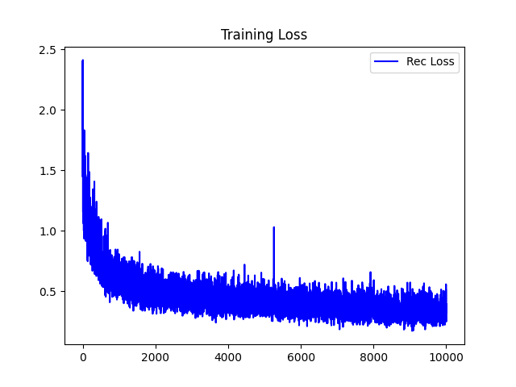
  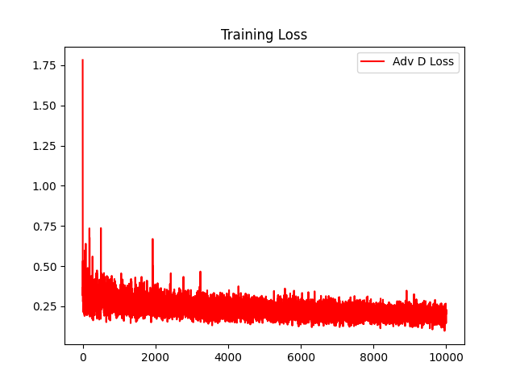
  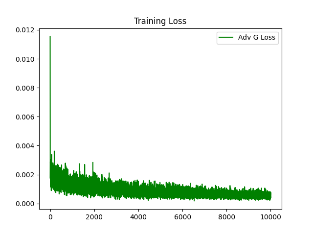
</p>

You can find more iteration-wise results in **[visualizations folder under style in pconv_test](visualizations/pconv_test/style)**.

#### Demo Results

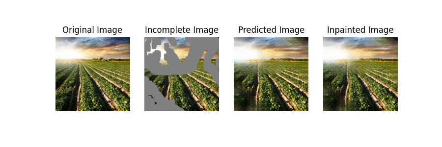

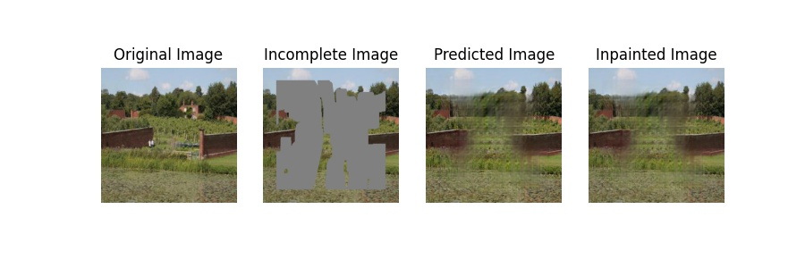

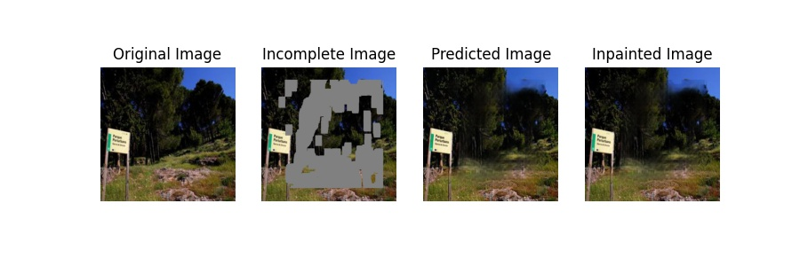


### Results using the Testing PConv Mask Dataset without Adversarial Loss

The model was trained for `10000 iterations` on a total of `18034 images` with  `batch size=8`. The checkpoint frequency was `2000 iterations`.

<p float="center">
  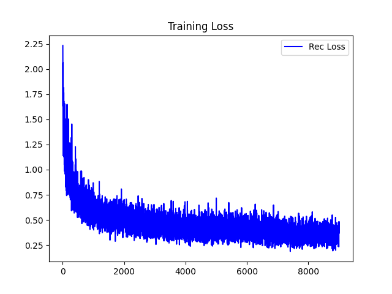
</p>

You can find more iteration-wise results in **[visualizations folder under no_adv in pconv_test](visualizations/pconv_test/no_adv)**.

#### Demo Results

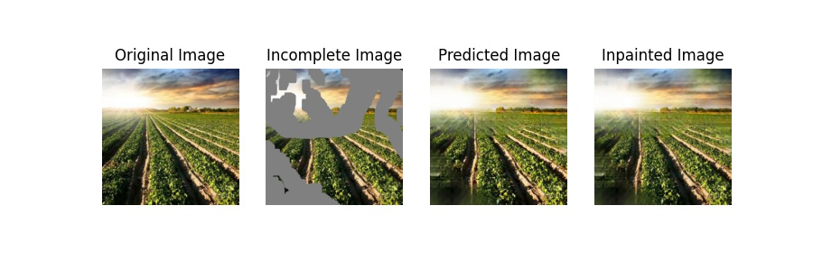


### Results using the Training PConv Mask Dataset

The model was trained for `40000 iterations` on a total of `18034 images` with  `batch size=8`. The checkpoint frequency was `2000 iterations`.

#### Iteration 40000


You can find more iteration-wise results in **[visualizations folder under pconv_train](visualizations/pconv_train/)**.


### Observations

- The **adversarial loss** doesn't seem to be contributing to the learning of the model as it stays almost the same throughout the training.

- The results don't look realistic from any angle adding weight to the possibility of failure in adversarial training when using **train pconv masks dataset**. However, if we use the **test pconv masks dataset** for training, the results are realistic even though adversarial losses don't contribute much to the learning.

- Training is beneficial only using the `testing pconv masks dataset`.

- Training for longer than `1e4` iterations doesn't add much improvement to the results.

- Training **without style loss** produces blurry results. Therefore, style loss is an important component for texture related synthesis of images.

- Training **without adversarial loss** also produces good quality results!

---

## Acknowledgements

Code is based on the official [AOT-GAN Repo](https://github.com/researchmm/AOT-GAN-for-Inpainting).
